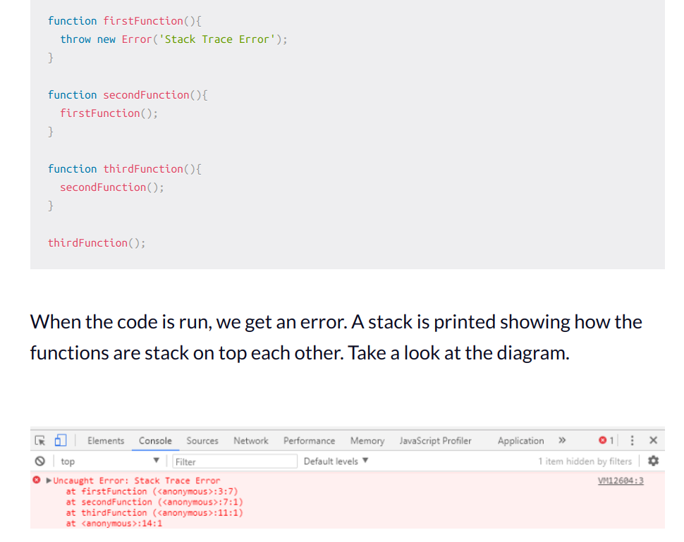

# Class 10 Notes - In Memory Storage

[Back to Home](../README.md)

## [Understanding the JS Call Stack](https://www.freecodecamp.org/news/understanding-the-javascript-call-stack-861e41ae61d4)

What is a ‘call’?

+ function invocation

How many ‘calls’ can happen at once?

+ one at a time

What does LIFO mean?

+ At the most basic level, a call stack is a data structure that uses the Last In, First Out (LIFO) principle to temporarily store and manage function invocation (call).

Draw an example of a call stack and the functions that would need to be invoked to generate that call stack.

What causes a Stack Overflow?

+ A stack overflow occurs when there is a recursive function (a function that calls itself) without an exit point. The browser (hosting environment) has a maximum stack call that it can accomodate before throwing a stack error.

## [Javascript Error Messages](https://codeburst.io/javascript-error-messages-debugging-d23f84f0ae7c)

What is a ‘reference error’?

+ This is as simple as when you try to use a variable that is not yet declared you get this type os errors.
+ This is also a common thing when using const and let, they are hoisted like var and function but there is a time between the hoisting and being declared so when you try to access them a reference error occurs, the fact that this happens to let and const is called Temporal Dead Zone (TDZ).

What is a ‘syntax error’?

+ this occurs when you have something that cannot be parsed in terms of syntax, like when you try to parse an invalid object using JSON.parse.
+ JSON.parse( {'foo': 'bar'} ) // Uncaught SyntaxError: Unexpected token o in JSON at position 1
+ JSON.parse('{"foo":"bar"}')
+ Some syntax errors like sending a trailing comma when calling a function are handled without error by most recent browsers, but older ones you have to be careful.

What is a ‘range error’?

+ Try to manipulate an object with some kind of length and give it an invalid length and this kind of errors will show up.

What is a ‘type error’?

+ this types of errors show up when the types (number, string and so on) you are trying to use or access are incompatible, like accessing a property in an undefined type of variable.
+ This is probably the most frequent error in JS, trying to access a property/method thinking that bar is of the type object when in reality, since it hasn’t been declared yet, it’s undefined which doesn’t have any baz available.
+ The fix is simple, just make sure that bar exists before trying to access it, either by creating bar or by checking for undefined.
What is a breakpoint?

What does the word ‘debugger’ do in your code?

+ The breakpoint can also be achieved by putting a debugger statement in your code in the line you want to break.
+ To debug your JS code, the easiest and maybe the most common way its to simply console.log() the variables you want to check 

## Bookmarks

### [Javascript Errors Ref. on MDN](https://developer.mozilla.org/en-US/docs/Web/JavaScript/Reference/Errors)
