# [Learn SQL](https://landing.chartio.com/download-learn-sql)

## [SQL Bolt](https://sqlbolt.com/)

I learned how tables work in SQL database and the commands that are used to search a database and create or change a database. The most important for searching are: SELECT * FROM table WHERE condition AND/OR  and ORDER BY and LIMIT.

## SQL Bolt Lessons

+ 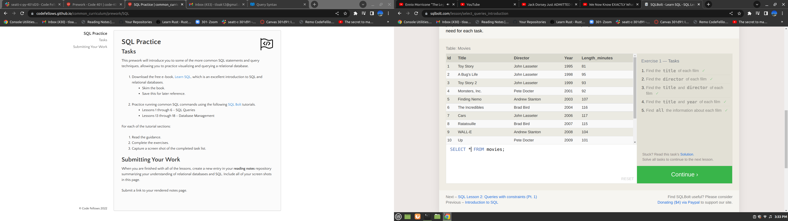
+ 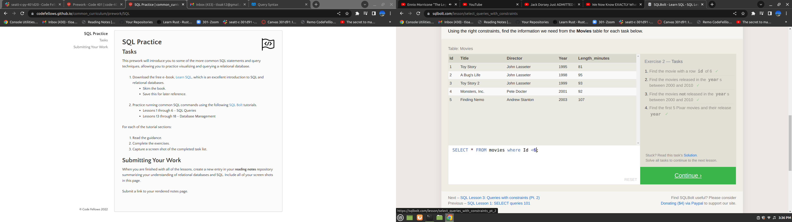
+ 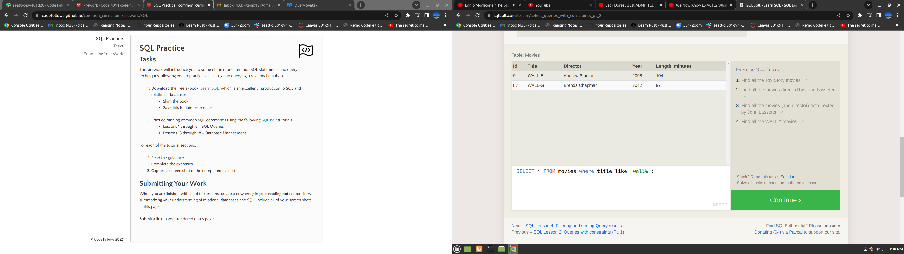
+ 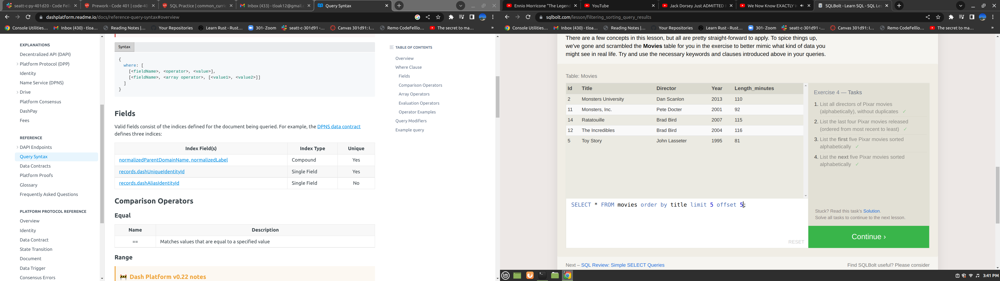
+ 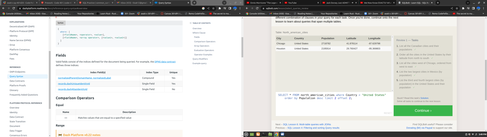
+ 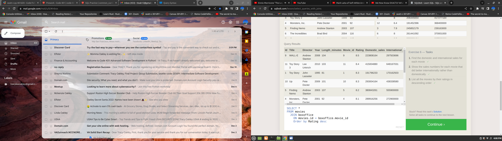
+ 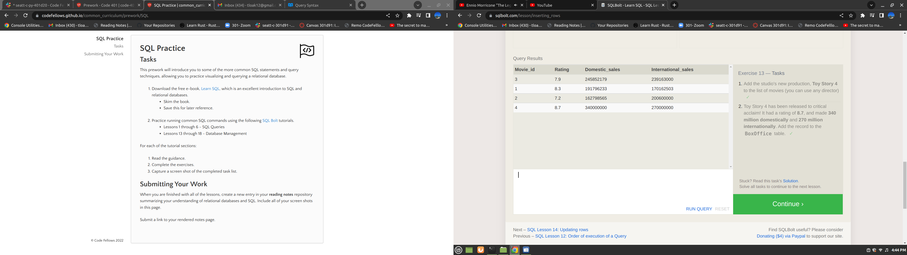
+ 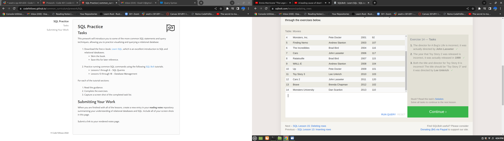
+ 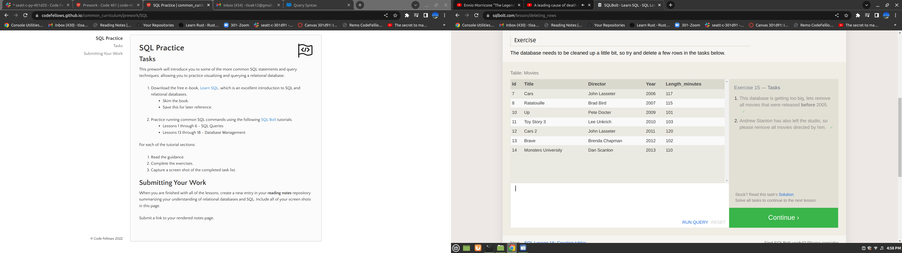
+ 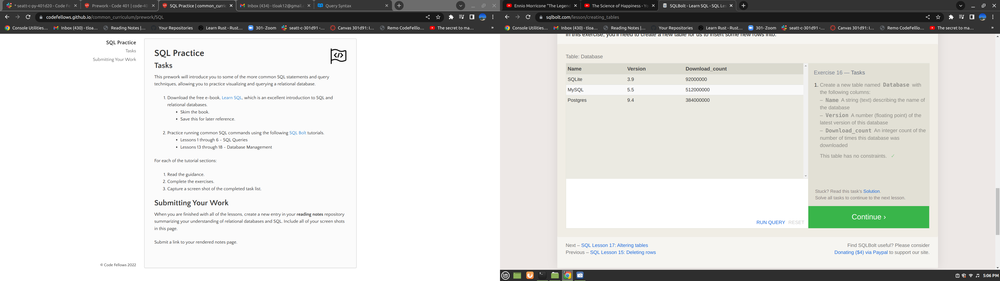
+ 
+ 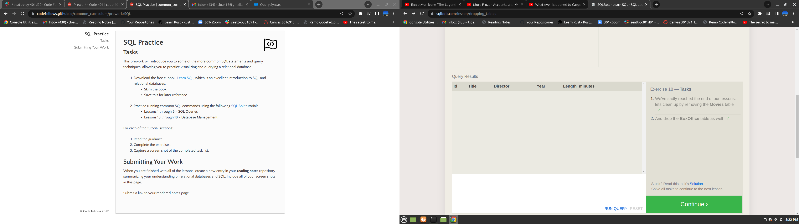
